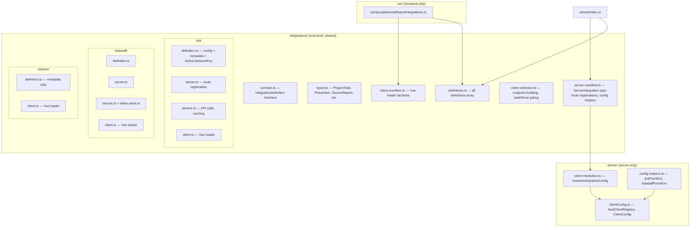

# DRY integrations with shared directory and manifest autoloading

## Architecture



## Key decisions

- **Root `integrations/`** for configurable, API-backed integrations (Jira, Hubstaff). Watson stays in `src/` — it's the local time tracker, not a customer-configurable integration.
- **Split manifests**: `definitions.ts` (shared), `server-manifest.ts` (Express routes + server helpers), `client-manifest.ts` (Vue loaders only). Prevents Vite from traversing server code.
- **Two-layer contract**: `IntegrationDefinition` (shared, no server deps) and `ServerIntegration` (extends definition with `readClientConfig` + `registerRoutes`). Only `server-manifest.ts` touches the server layer.
- **Server-only files stay in `server/`**: `client-resolution.ts` and `config-helpers.ts` import from `server/clientConfig.ts` — they **cannot** live in the shared root or Vite will follow the imports into Express. They stay under `server/` and are imported only by `server-manifest.ts`.
- **Separate service files**: `server.ts` (thin route registration) + `service.ts` (business logic, caching, API calls). Keeps files under 500 lines.
- **Keep NodeNext** on server tsconfig. Validate `rootDir: "."` output paths. Keep `.js` extensions in server imports. The shared `integrations/` directory uses `.js` extensions when imported from server context.
- **`configKey` is dropped** — `readClientConfig` is a closure that already knows which property to read (`(client) => client.jira`). No need for a string key.
- **Watson moves to `integrations/watson/`** — same folder structure as Jira/Hubstaff but simpler: `definition.ts` (metadata only, doesn't satisfy `IntegrationDefinition` since it has no config) and `client.ts` (Vue loader). No `server.ts` or `service.ts` — Watson's API is part of the core server (`/api/frames`), not a pluggable integration route. Watson doesn't join the `definitions` array (that's for configurable integrations) but its loader is exported from `client-manifest.ts`.
- **Path alias `#integrations`** in both tsconfigs + Vite `resolve.alias` — clean imports from any depth.

## Integration contract (two layers)

### Shared contract (both sides)

```typescript
// integrations/contract.ts
export interface IntegrationDefinition<TConfig = unknown> {
  id: string;
  label: string;
  apiPrefix: string;
  normalizeConfig(raw: TConfig | undefined): TConfig | undefined;
  isConfigured(config: TConfig | undefined): config is TConfig;
  legacyGlobalConfig(): TConfig | undefined;
}
```

Each definition uses `satisfies`:

```typescript
// integrations/jira/definition.ts
export const jiraDefinition = {
  id: "jira" as const,
  label: "Jira",
  apiPrefix: "/api/jira",
  normalizeConfig: normalizeJiraConfig,
  isConfigured: isJiraConfigured,
  legacyGlobalConfig: legacyGlobalJiraConfig,
} satisfies IntegrationDefinition<ClientJiraConfig>;
```

### Server contract (server-manifest only)

```typescript
// integrations/server-manifest.ts (top section)
import type { Express, Request } from "express";
import type { ClientConfig } from "../server/clientConfig.js";
import type { IntegrationDefinition } from "./contract.js";

type ReadClientQuery = (request: Request) => string | undefined;

interface ServerIntegration<TConfig> extends IntegrationDefinition<TConfig> {
  readClientConfig(client: ClientConfig): TConfig | undefined;
  registerRoutes(app: Express, readClientQuery: ReadClientQuery): void;
}
```

This keeps `ClientConfig` and Express types out of the shared contract entirely.

## Three manifests

```typescript
// integrations/definitions.ts — SHARED (both sides)
import { jiraDefinition } from "./jira/definition.js";
import { hubstaffDefinition } from "./hubstaff/definition.js";

export const definitions = [jiraDefinition, hubstaffDefinition] as const;
export type IntegrationId = (typeof definitions)[number]["id"];
```

```typescript
// integrations/server-manifest.ts — SERVER ONLY
import type { Express, Request } from "express";
import type { ClientConfig } from "../server/clientConfig.js";
import type { IntegrationDefinition } from "./contract.js";
import { jiraDefinition, type ClientJiraConfig } from "./jira/definition.js";
import { registerJiraRoutes } from "./jira/server.js";
import { hubstaffDefinition, type ClientHubstaffConfig } from "./hubstaff/definition.js";
import { registerHubstaffRoutes } from "./hubstaff/server.js";
import { integrationEnabledClientCount } from "../server/client-resolution.js";

// --- Types (server-only, not shared) ---

export type ReadClientQuery = (request: Request) => string | undefined;

interface ServerIntegration<TConfig> extends IntegrationDefinition<TConfig> {
  readClientConfig(client: ClientConfig): TConfig | undefined;
  registerRoutes(app: Express, readClientQuery: ReadClientQuery): void;
}

// --- Server integration objects (spread shared definition + server-only fields) ---

const jiraIntegration: ServerIntegration<ClientJiraConfig> = {
  ...jiraDefinition,
  readClientConfig: (client) => client.jira,
  registerRoutes: registerJiraRoutes,
};

const hubstaffIntegration: ServerIntegration<ClientHubstaffConfig> = {
  ...hubstaffDefinition,
  readClientConfig: (client) => client.hubstaff,
  registerRoutes: registerHubstaffRoutes,
};

const integrations = [jiraIntegration, hubstaffIntegration] as const;

// --- Helpers used by server/clientConfig.ts ---

export function normalizeClientIntegrations(entry: Partial<ClientConfig>) {
  return {
    jira: jiraIntegration.normalizeConfig(entry.jira),
    hubstaff: hubstaffIntegration.normalizeConfig(entry.hubstaff),
  };
}

export function buildClientIntegrationFlags(client: ClientConfig) {
  const flags: Record<string, boolean> = {};
  for (const integration of integrations) {
    flags[integration.id] = (integration as ServerIntegration<unknown>)
      .isConfigured(integration.readClientConfig(client));
  }
  return { integrations: flags };
}

export async function getIntegrationEnabledCounts() {
  const results = await Promise.all(
    integrations.map(async (integration) => ({
      id: integration.id,
      count: await integrationEnabledClientCount(integration),
    }))
  );
  const counts: Record<string, number> = {};
  for (const { id, count } of results) counts[id] = count;
  return { integrationEnabledCounts: counts };
}

export function mountIntegrationRoutes(app: Express, readClientQuery: ReadClientQuery) {
  for (const integration of integrations) {
    integration.registerRoutes(app, readClientQuery);
  }
}
```

```typescript
// integrations/client-manifest.ts — FRONTEND ONLY
export { createLoader as createJiraLoader } from "./jira/client";
export { createLoader as createHubstaffLoader } from "./hubstaff/client";
export { createLoader as createWatsonLoader } from "./watson/client";
```

## Per-integration folder convention

| File | Purpose | Imported by |
|------|---------|-------------|
| `definition.ts` | Config type, normalize, isConfigured, legacyGlobal, metadata, shared utils (e.g. `looksLikeIssueKey`) | Both (via `definitions.ts` or directly) |
| `server.ts` | `registerRoutes(app, readClient)` — thin Express route handlers | Server (via `server-manifest.ts`) |
| `service.ts` | Business logic, API calls, caching, token management | `server.ts` only |
| `client.ts` | `createLoader(context)` → `{ sourceReports, issues, issueMap, load, reset }` | Frontend (via `client-manifest.ts`) |

### DRY wins within per-integration folders

**`looksLikeIssueKey` + `ISSUE_KEY_PATTERN`** currently duplicated in `src/integrations/jira.ts` and `server/integrations/issue-tracker/jira/service.ts`. Move to `integrations/jira/definition.ts` — both `server.ts` and `client.ts` import from definition.

## Types: ProjectTotal moves to shared

`ProjectTotal` is currently in `src/types.ts` and imported by `src/integrations/types.ts`. Since `integrations/types.ts` moves to the shared root, `ProjectTotal` must come along:

```typescript
// integrations/types.ts
/** Duration tracked for a named entity (project, client, etc.). */
export type ProjectTotal = {
  name: string;
  duration: number;
};

export type PickerItem = { key: string; summary: string; status?: string; url?: string };
export type DayReport = { /* ... */ };
export type SourceReport = { /* ... */ };
export type UnifiedDaySummary = { /* ... */ };
export type ApiIntegrationDefinition = { /* ... */ };

// Wire-format types from Hubstaff API
export type HubstaffProjectTotal = { /* ... */ };
export type HubstaffDailyEntry = { /* ... */ };
export type HubstaffReport = { /* ... */ };
```

```typescript
// src/types.ts — backward compat re-export
export type { ProjectTotal } from "#integrations/types";
// ... rest of src/types.ts unchanged
```

## Build config changes

- **`tsconfig.server.json`**: keep `module: NodeNext`, `moduleResolution: NodeNext`; change `rootDir` from `"server"` to `"."`; add `"integrations/**/*.ts"` to `include`
- **`tsconfig.json` (frontend)**: add `"integrations/**/*.ts"` to `include`; exclude `integrations/**/server.ts`, `integrations/**/service.ts`, `integrations/**/token-store.ts`, and `integrations/server-manifest.ts`
- **Both tsconfigs**: add path alias `"#integrations/*": ["integrations/*"]`
- **`vite.config.ts`**: add `resolve.alias: { "#integrations": path.resolve(__dirname, "integrations") }`
- **`dist-server/` output**: with `rootDir: "."`, output becomes `dist-server/server/index.js` and `dist-server/integrations/...` — update `start` script:

```json
"start": "tsx dist-server/server/index.js"
```

## Server-only files stay in server/

These files import from `server/clientConfig.ts` and **must not** be in the shared `integrations/` directory — Vite would follow the imports into Express/Node code:

| File | Why server-only |
|------|----------------|
| `server/client-resolution.ts` | Imports `loadClientRegistry` from `server/clientConfig.ts` |
| `server/config-helpers.ts` | Imports `env()` from `server/clientConfig.ts` |

They move from `server/integrations/` up to `server/` (flattened), not to root `integrations/`. `server-manifest.ts` imports them via relative paths (`../server/client-resolution.js`).

### Avoiding circular imports

`server-manifest.ts` imports `integrationEnabledClientCount` from `server/client-resolution.ts`. The current code has `client-resolution.ts` import `ServerIntegration` type via `Pick<ServerIntegration, ...>` — doing the same with the new layout would create a circular dependency.

Fix: `IntegrationResolver` becomes a standalone structural type in `server/client-resolution.ts` instead of `Pick<ServerIntegration<TConfig>, ...>`:

```typescript
// server/client-resolution.ts
export type IntegrationResolver<TConfig> = {
  legacyGlobalConfig(): TConfig | undefined;
  isConfigured(config: TConfig | undefined): config is TConfig;
  readClientConfig(client: ClientConfig): TConfig | undefined;
};
```

TypeScript structural typing means `ServerIntegration` objects satisfy `IntegrationResolver` without an explicit import — no circular dependency.

### Service files import from server/

`integrations/jira/service.ts` and `integrations/hubstaff/service.ts` import `ResolvedIntegrationConfig` and `resolveIntegrationConfig` from `../../server/client-resolution.js`. This is a cross-boundary import (shared `integrations/` → `server/`), but it is safe because these files are excluded from the frontend tsconfig and Vite never traverses them.

## Watson: same folder, simpler definition

Watson is the local time tracker — always active, no config normalization, no server routes. It lives in `integrations/watson/` alongside Jira and Hubstaff for consistency but has a simpler shape:

```typescript
// integrations/watson/definition.ts
export const watsonDefinition = {
  id: "watson" as const,
  label: "Watson",
} as const;
```

No `apiPrefix`, `normalizeConfig`, `isConfigured`, or `legacyGlobalConfig` — Watson doesn't satisfy `IntegrationDefinition` and doesn't join the `definitions` array. Its `client.ts` is the existing `createWatsonIntegration` factory, exported via `client-manifest.ts`. The orchestrator imports all three loaders from the same manifest.

Watson's API (`/api/frames`) remains in `server/index.ts` — it's core server functionality, not a pluggable integration route.

## Migration: what moves where

| Current location | New location |
|-----------------|--------------|
| `server/integrations/issue-tracker/jira/config.ts` | `integrations/jira/definition.ts` |
| `server/integrations/issue-tracker/jira/routes.ts` | `integrations/jira/server.ts` |
| `server/integrations/issue-tracker/jira/service.ts` | `integrations/jira/service.ts` |
| `server/integrations/time-tracker/hubstaff/config.ts` | `integrations/hubstaff/definition.ts` |
| `server/integrations/time-tracker/hubstaff/routes.ts` | `integrations/hubstaff/server.ts` |
| `server/integrations/time-tracker/hubstaff/service.ts` | `integrations/hubstaff/service.ts` |
| `server/integrations/time-tracker/hubstaff/token-store.ts` | `integrations/hubstaff/token-store.ts` |
| `server/integrations/index.ts` | Removed (barrel; consumers import from new locations directly) |
| `server/integrations/README.md` | Removed |
| `server/integrations/registry.ts` | Split: shared definitions → `integrations/definitions.ts`, server objects + helpers → `integrations/server-manifest.ts` |
| `server/integrations/client-resolution.ts` | `server/client-resolution.ts` (stays server-only, flattened) |
| `server/integrations/config-helpers.ts` | `server/config-helpers.ts` (stays server-only, flattened) |
| `server/integrations/types.ts` | Split: `ReadClientQuery` + `ResolvedIntegrationConfig` → `server/client-resolution.ts`; `ServerIntegration` → `integrations/server-manifest.ts`; `IntegrationId` → `integrations/definitions.ts` |
| `server/integrations/issue-tracker/types.ts` | `integrations/jira/definition.ts` (inline `IssueTrackerIssue`) |
| `server/integrations/time-tracker/types.ts` | `integrations/hubstaff/definition.ts` (inline time-tracker types) |
| `src/integrations/jira.ts` | `integrations/jira/client.ts` |
| `src/integrations/hubstaff.ts` | `integrations/hubstaff/client.ts` |
| `src/integrations/watson.ts` | `integrations/watson/client.ts` (+ new `integrations/watson/definition.ts` for metadata) |
| `src/integrations/types.ts` | `integrations/types.ts` (+ `ProjectTotal` from `src/types.ts`) |
| `src/integrations/client-selection.ts` | `integrations/client-selection.ts` |
| `src/integrations/useReportIntegrations.ts` | `src/composables/useReportIntegrations.ts` |
| `src/integrations/registry.ts` | Removed (replaced by `#integrations/definitions`) |
| `src/types.ts` → `ProjectTotal` | Re-exports from `#integrations/types` |

## What gets deleted

Entire directories removed (contents migrated to new locations):

- `server/integrations/` — including `index.ts` barrel and `README.md`

`src/integrations/` — entire directory removed (all contents migrated):

- `registry.ts` — replaced by `#integrations/definitions`
- `types.ts` — moved to `integrations/types.ts`
- `client-selection.ts` — moved to `integrations/client-selection.ts`
- `jira.ts` — moved to `integrations/jira/client.ts`
- `hubstaff.ts` — moved to `integrations/hubstaff/client.ts`
- `watson.ts` — moved to `integrations/watson/client.ts`
- `useReportIntegrations.ts` — moved to `src/composables/useReportIntegrations.ts`

Types removed (no longer needed):

- `IntegrationConfigKey` — was only used for the dropped `configKey` field

## Typed action strings

In `src/utils/offlineWatsonActions.ts`:

```typescript
export const WatsonActionType = {
  Start: "start",
  Switch: "switch",
  Stop: "stop",
} as const;

export type WatsonActionType = (typeof WatsonActionType)[keyof typeof WatsonActionType];
```

## Tests

Add **Vitest** (shares Vite transform pipeline).

### Setup

- `npm install -D vitest`
- `vitest.config.ts` extending vite config (with `#integrations` alias)
- `"test": "vitest run"` script
- Back up Watson state before first run

### Test coverage

**Frontend** (`tests/integrations/`):
- `watson-report.test.ts` — buildReport totals, daily, capability flags
- `hubstaff-report.test.ts` — reportToSource conversion, picker items
- `unified-days.test.ts` — multi-source merge, sorting, capability propagation
- `client-selection.test.ts` — endpoint building, load/show gating

**Server** (`tests/server/`):
- `jira-config.test.ts` — normalizeJiraConfig validation
- `hubstaff-config.test.ts` — normalizeHubstaffConfig, projectIds parsing
- `client-resolution.test.ts` — config resolution scenarios
- `integration-counts.test.ts` — batched count computation from definitions

**Shared** (`tests/shared/`):
- `issue-key.test.ts` — looksLikeIssueKey, parseIssueKey from shared definition

### Constraints

- No Watson CLI calls — pure functions with fixture data
- No network calls — mock fetch at function boundary
- No localStorage — mock or in-memory store
